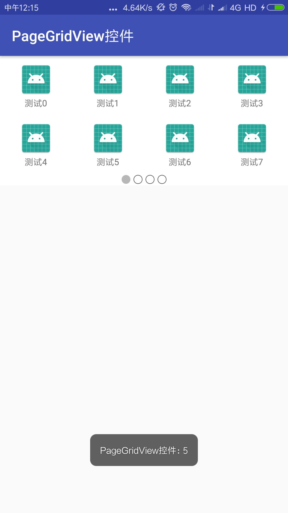

# PageGridView
ViewPager+GridView组合控件实现网格布局分页效果

## PageGridView 特点

- 可自由定制Item布局
- 无需写adapter适配器,直接调用setData()方法填充数据
- 只需实体类继承ItemModel即可
- 可显示本地图、网络图、资源ID图标，由开发者实现
- 动态计算PageGridView高度，不需要在布局里面写固定高度
- 可重复setData()方法刷新数据


## PageGridView自定义属性
属性名 | 说明 | 默认值
:----------- | :----------- | :-----------
pageSize                | 每页大小               | 8
numColumns              | 列数                   | 4
isShowIndicator         | 是否显示指示器          | true
selectedIndicator       | 选中指示点资源ID        | R.drawable.shape_dot_selected
unSelectedIndicator     | 未选中指示点资源ID      | R.drawable.shape_dot_normal
indicatorGravity        | 指示器位置             | center
indicatorPaddingLeft    | 指示器左内边距          | 0px
indicatorPaddingRight   | 指示器右内边距          | 0px
indicatorPaddingTop     | 指示器上内边距          | 0px
indicatorPaddingBottom  | 指示器下内边距          | 0px
indicatorPadding        | 指示器内边距            | 0px
indicatorBackground     | 指示器背景颜色          | Color.WHITE 
itemView                | Item布局               | R.layout.item_view


## 约定规则
1. Item布局必须给定具体高度，默认itemView布局的高度为@dimen/item_height=80dp
2. Item布局 TextView的id 为R.id.tv_item_name
3. Item布局 ImageView的id 为R.id.iv_item_icon
4. Item默认点击效果R.drawable.selector_item_view_bg
5. Item点击颜色值：R.color.item_view_selected_color
6. Item背景颜色值：R.color.item_view_normal_color
7. 指示器点的的选中颜色为R.color.dot_selected_color


## 一行四列效果图


## 两行四列效果图



## PageGridView使用

### Gradle 依赖库
```groovy
allprojects {
    repositories {
        maven{
            url 'https://dl.bintray.com/lingguoding/maven/'
        }
    }
}

implementation 'com.wihaohao:PageGridView:1.1.1'


```

### 默认布局
一般默认参数即可满足需求
```xml
<com.wihaohao.PageGridView
          android:id="@+id/vp_grid_view"
          android:layout_width="match_parent"
          android:layout_height="wrap_content"
          />
          
```


### 一行4列的布局

```xml

  <com.wihaohao.PageGridView
          android:id="@+id/vp_grid_view"
          android:layout_width="match_parent"
          android:layout_height="wrap_content"
          app:numColumns="4"
          app:pageSize="4"
          app:selectedIndicator="@mipmap/ic_dot_selected"
          app:unSelectedIndicator="@mipmap/ic_dot_normal"
          app:isShowIndicator="true"
          />


```

### 两行4列的布局
```xml

    <com.wihaohao.PageGridView
        android:id="@+id/vp_grid_view"
        android:layout_width="match_parent"
        android:layout_height="wrap_content"
        app:indicatorPadding="10dp"
        app:isShowIndicator="true"
        app:itemView="@layout/my_item_view"
        app:numColumns="4"
        app:pageSize="8"
        app:selectedIndicator="@mipmap/ic_dot_selected"
        app:unSelectedIndicator="@mipmap/ic_dot_normal" />

```

### 自定义Item布局
```xml

 <com.wihaohao.PageGridView
        android:id="@+id/p_grid_view2"
        android:layout_width="match_parent"
        android:layout_height="wrap_content"
        app:indicatorGravity="right"
        app:indicatorPaddingRight="@dimen/padding_10"
        app:isShowIndicator="true"
        app:itemView="@layout/item_custom"
        app:indicatorBackground="@color/colorPrimary"
        app:numColumns="5"
        app:pageSize="5"/>


```


### ItemModel

```java

public abstract static class ItemModel {
        /**
         * 返回item名字
         *
         * @return
         */
        protected abstract String getItemName();

        /**
         * 设置图标
         *
         * @param imageView
         */
        protected abstract void setIcon(ImageView imageView);

        /**
         * 特殊需求，重写该方法，设置item
         *
         * @param itemView
         */
        protected void setItemView(View itemView) {

        }
    }


```

### Model
### 继承VpGridView.ItemModel 为item赋值和设置图标

```java

public class MyIconModel extends PageGridView.ItemModel {
    private String name;


    private int iconId;


    public String getName() {
        return name;
    }

    public void setName(String name) {
        this.name = name;
    }

    public int getIconId() {
        return iconId;
    }

    public void setIconId(int iconId) {
        this.iconId = iconId;
    }

    public MyIconModel(String name, int iconId) {
        this.name = name;
        this.iconId = iconId;
    }

    @Override
    protected String getItemName() {
        return name;
    }

    @Override
    protected void setIcon(ImageView imageView) {
        imageView.setImageResource(iconId);
    }
}

```

### 继承VpGridView.ItemModel 设置ItemView

```java

public class CustomModel extends PageGridView.ItemModel {

    public String title;

    public CustomModel(String title) {
        this.title = title;
    }

    @Override
    protected String getItemName() {
        return null;
    }

    @Override
    protected void setIcon(ImageView imageView) {

    }

    @Override
    protected void setItemView(View itemView) {
        TextView textView= (TextView) itemView;
        textView.setText(title);
    }
}


```


### PageGridView的使用

```java

public class MainActivity extends AppCompatActivity {

    List<MyIconModel> mList;
    List<CustomModel> mList2;

    private PageGridView<MyIconModel> mPageGridView;
    private PageGridView<CustomModel> mPageGridView2;
    @Override
    protected void onCreate(Bundle savedInstanceState) {
        super.onCreate(savedInstanceState);
        setContentView(R.layout.activity_main);
        mPageGridView =findViewById(R.id.vp_grid_view);
        initData();
        mPageGridView.setData(mList);
        mPageGridView.setOnItemClickListener(new PageGridView.OnItemClickListener() {
            @Override
            public void onItemClick(int position) {
                Toast.makeText(MainActivity.this,position+"",Toast.LENGTH_SHORT).show();
            }
        });

        //自定义item
        mPageGridView2=findViewById(R.id.p_grid_view2);
        mPageGridView2.setData(mList2);


    }

    private void initData() {
        mList=new ArrayList<>();
        mList2=new ArrayList<>();
        for(int i=0;i<30;i++){
            mList.add(new MyIconModel("测试"+i,R.mipmap.ic_launcher));
            mList2.add(new CustomModel("标题"+i));
        }
    }
}

```


